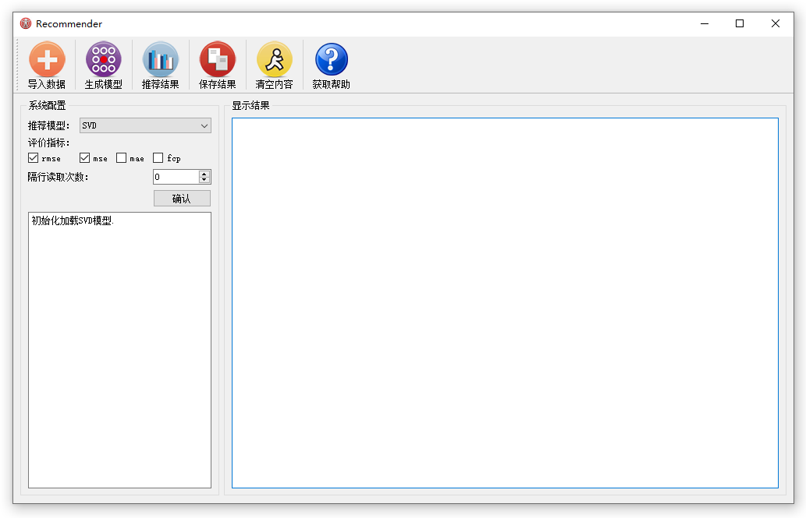
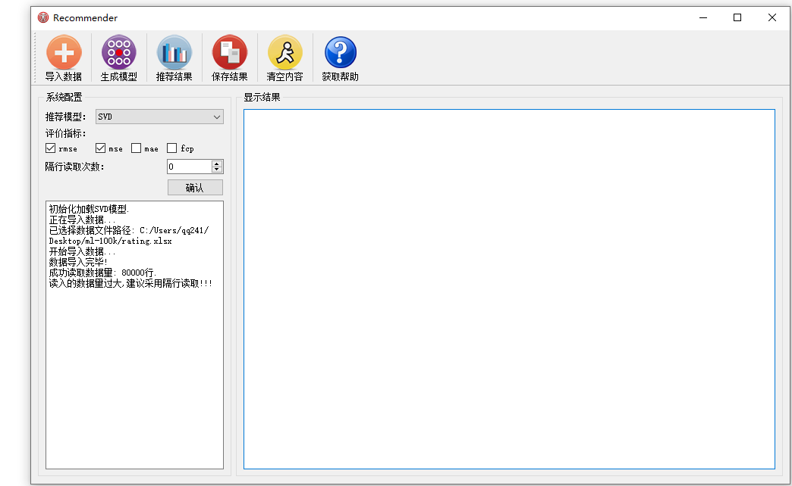
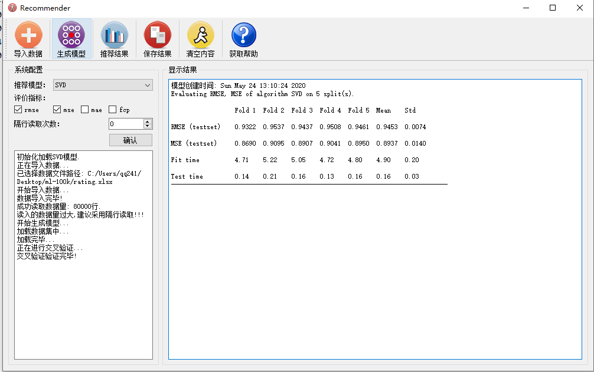
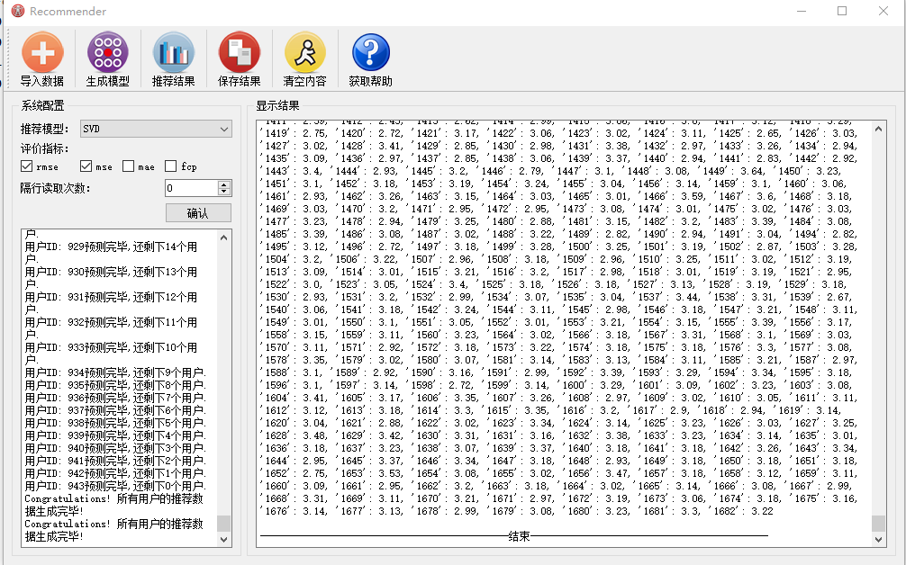
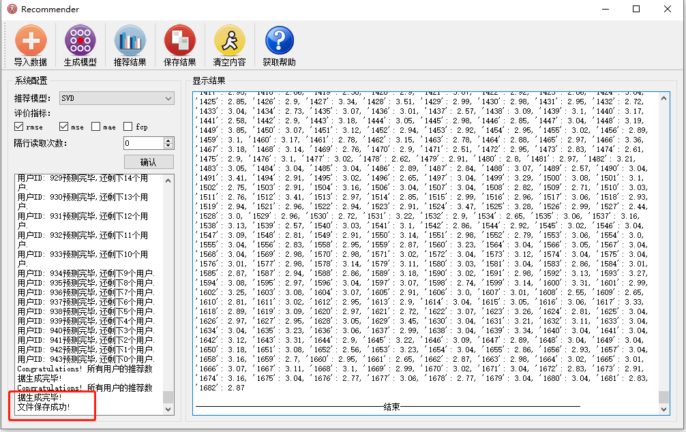
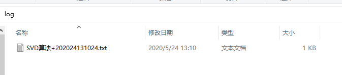

# RecommendSystem
使用Pyqt5开发了一个小型的推荐软件，做到输入用户-商品评分文件，就可以调用目前较为完备的推荐算法生成用户的预测评分。

# 简介  
这是一个学习周期很长的项目，跨度从大二到大四，终于有一天觉得不行了，必须要拿出点什么东西，于是就开发了这个东西 **RecommendSystem**,我觉得前面 还有加一个 **small** 才恰当。

# 具体情况

## 打开软件的界面显示

## 导入数据界面显示

## 生成模型界面显示

## 生成推荐文件界面显示

## 保存文件

## 保存日志

# 使用说明

